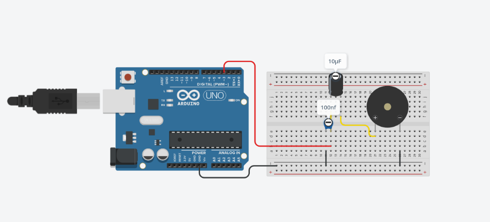
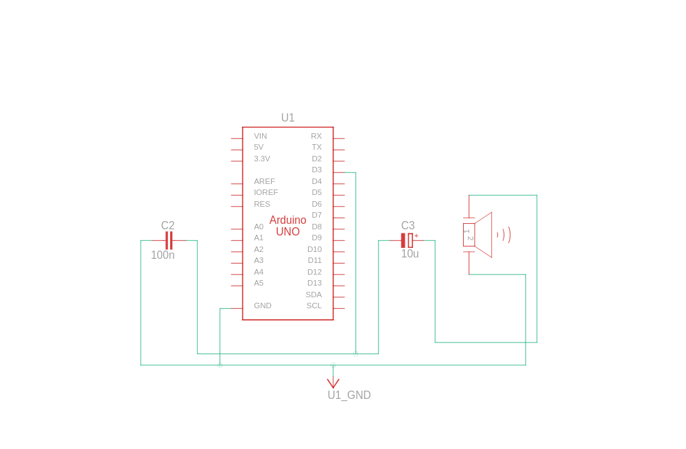

# 🚀 1-Arduino Standalone (Tek Kart) TTS Sistemi Kurulum Rehberi

Hoş geldiniz! Bu klasör, **tek bir Arduino Uno veya Nano** kartıyla hiçbir ek kart veya karmaşık haberleşme hattı kurmadan çalışabilen, **16.000 Hz** örnekleme hızına sahip bağımsız Türkçe ses sentezleyicidir.

## 🛠️ Nasıl Çalışıyor?
Tüm 24 Türkçe ses birimi (fonem) 16kHz kalitesinde aşırı derecede sıkıştırılıp optimize edilmiştir. 
* Ses verisi tek bir Arduino'nun 32KB'lık flash belleğine (tam olarak **25.9KB** yer kaplayacak şekilde) sığdırılmıştır.
* I2C haberleşme veya ek kartlar yoktur. Cümle doğrudan tek kartın içinden sentezlenip çalar.

---

## 🔌 Donanım Bağlantı Şeması (Basit Gürültü Filtresi)

Sadece tek bir kart kullandığımız için donanım bağlantısı son derece basittir:

### 📸 Devre Görselleri (Fritzing Breadboard ve Şematik)




### 📌 Şematik Bağlantı Bağları:
```text
Arduino Pin 3 ───[ 1K Ohm Direnç ]───┬───[ + AUX / Kulaklık Sinyali ]
                                     │
                             [ 100nF (104) ]
                                     │
Arduino GND ─────────────────────────┴───[ - AUX / Kulaklık Toprağı ]
```

* **100nF Kondansatör (104):** Bir bacağı dirençten çıkan hatta, diğer bacağı GND hattına bağlanır. Yüksek frekanslı PWM vınlamasını süzerek sesin pürüzsüz çıkmasını sağlar.
* **Ses Çıkışı:** Filtrelenmiş bu noktadan doğrudan kulaklık veya amfi girişine bağlayarak ses alabilirsiniz!

---

## 💻 Yazılım Kurulumu

1. Bilgisayarınızda bu klasörün içinde terminali açın ve `generate_phonemes.py` dosyasını çalıştırın:
   ```bash
   python3 generate_phonemes.py
   ```
   *Bu komut, tüm fonemleri 16kHz kalitesinde tek bir `phonemes.h` kütüphanesine derleyip `single_arduino_tts/` klasörünün içine yerleştirecektir.*

2. Arduino IDE ile kodları kartınıza yükleyin:
   - `single_arduino_tts/single_arduino_tts.ino` dosyasını Arduino'nuza yükleyin.

3. Konuşturma ve Kaydetme Arayüzünü Açın:
   ```bash
   python3 gui.py
   ```
   *Bu arayüzden dilediğiniz Türkçe cümleyi yazabilir, tek tıkla hem bilgisayarınıza `sesler/` klasörüne kaydedebilir hem de Arduino'nuzdan dinleyebilirsiniz!*
