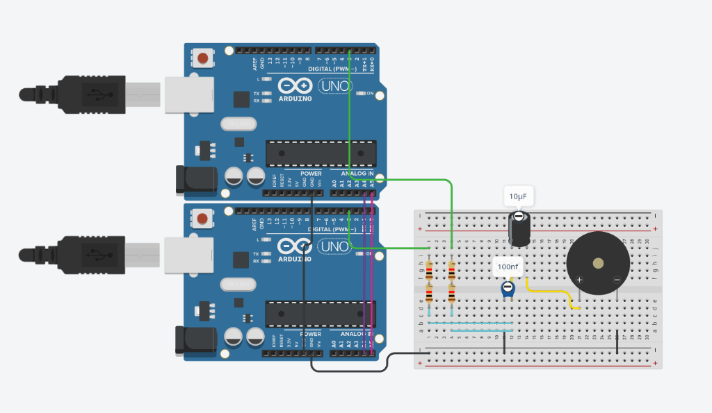
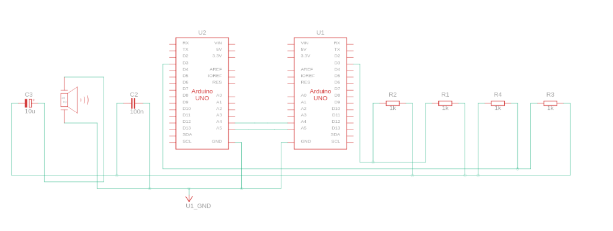

# 🚀 2-Node (Master + 1 Slave) Arduino TTS Sistemi Kurulum Rehberi

Hoş geldiniz! Bu klasör, **iki Arduino** kartının (örneğin 1 Master Uno ve 1 Slave Uno) hafızalarını birleştirerek çalışan **64 KB devasa ses belleğine** sahip **24.000 Hz** Türkçe ses sentezleyicidir.

## 🛠️ Nasıl Çalışıyor?
Python betiği (`generate_phonemes.py`), 24 farklı Türkçe fonemi kartların bellek durumlarına göre tam ortadan 2'ye böler:
1. **Master (Arduino Uno):** Seslerin yarısını kendi hafızasında tutar ve okur. Aynı zamanda metni I2C haberleşme hattından Slave karta iletir.
2. **Slave 1 (Arduino Uno/Nano):** Seslerin diğer yarısını hafızasında tutar ve okur.

Sistem okuma yaparken, hangi kartın harfi geldiyse o kart ses üretir, diğeri sessizce bekler. Çıkışlar pasif mikser devresinde birleştiği için hoparlörden tek parça pürüzsüz analog ses duyulur.

---

## 🔌 Fiziksel Bağlantı Şeması (İki Kart İçin Mikser & Filtre)

İki kartın ses çıkışlarını karıştırmak ve gürültüyü engellemek için şu bağlantıyı yapmalısınız:

### Adım 1: Haberleşme (I2C) Bağlantıları
* **İki Kartın GND Pinleri** ➡️ Birbirine bağlanacak (Ortak Toprak).
* **İki Kartın A4 Pinleri (SDA)** ➡️ Birbirine bağlanacak.
* **İki Kartın A5 Pinleri (SCL)** ➡️ Birbirine bağlanacak.

### Adım 2: Pasif Mikser ve Filtre Devresi
İki kartın Pin 3 çıkışlarını birleştirerek gürültü filtresine yolluyoruz:

### 📸 Devre Görselleri (Fritzing Breadboard ve Şematik)




### 📌 Şematik Bağlantı Bağları:
```text
Master Pin 3   ───[ 1K Ohm Direnç ]───┬─── Ortak Buluşma Noktası (X) ───[ + AUX ]
                                      │
Slave 1 Pin 3  ───[ 1K Ohm Direnç ]───┤
                                      │
                              [ 100nF (104) ]
                                      │
Ortak GND      ───────────────────────┴─────────────────────────────────[ - AUX ]
```

* **1K Dirençler:** Her iki kartın Pin 3 çıkışına birer adet 1K direnç bağlanır ve diğer uçları ortak bir noktada (X Noktası) birleştirilir.
* **100nF Kondansatör (104):** Bir bacağı X Noktasına, diğer bacağı ortak GND (Toprak) hattına bağlanır.
* **Ses Çıkışı:** Artı (+) kutbunu X Noktasından, Eksi (-) kutbunu ise ortak GND hattından alarak amfiye veya AUX girişine bağlayın!

---

## 💻 Yazılım Kurulumu

1. Bilgisayarınızda bu klasörün içinde terminali açın ve `generate_phonemes.py` dosyasını çalıştırın:
   ```bash
   python3 generate_phonemes.py
   ```
   *Bu komut, fonemleri iki kart için 2'ye bölecek, 'ai_master/' ve 'ai_slave/' klasörlerine özel 'phonemes.h' dosyalarını üretecektir.*

2. Arduino IDE ile kodları kartlarınıza yükleyin:
   - `ai_master/ai_master.ino` ➡️ Master kartınıza yükleyin.
   - `ai_slave/ai_slave.ino` ➡️ Slave 1 kartınıza yükleyin.

3. Kontrol Paneli Arayüzünü Açın:
   ```bash
   python3 gui.py
   ```
   *Metni girip "Metni Sentezle ve Çal" butonuna bastığınızda, iki Arduino senkronize çalışarak 24kHz kalitesinde konuşacaktır!*
