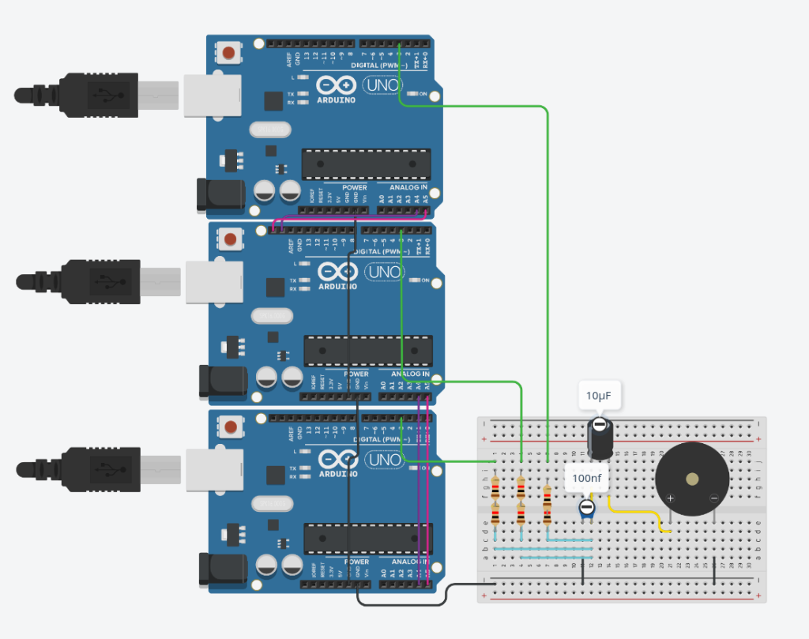

# 🚀 3-Node (Master + 2 Slave) Arduino TTS Sistemi Kurulum Rehberi

Hoş geldiniz! Bu klasör, **üç Arduino** kartının (örneğin 1 Master Uno, 1 Slave Uno ve 1 Slave Nano) hafızalarını birleştirerek çalışan **96 KB devasa ses belleğine** sahip **24.000 Hz** Türkçe ses sentezleyicidir.

## 🛠️ Nasıl Çalışıyor?
Python betiği (`generate_phonemes.py`), 24 farklı Türkçe fonemi kartların bellek durumlarına göre 3 eşit parçaya böler:
1. **Master (Arduino Uno):** Seslerin 1/3'ünü kendi hafızasında tutar ve okur. Aynı zamanda metni I2C haberleşme hattından Slave kartlara iletir.
2. **Slave 1 (Arduino Uno):** Seslerin diğer 1/3'ünü hafızasında tutar ve okur.
3. **Slave 2 (Arduino Nano):** Seslerin son 1/3'ünü hafızasında tutar ve okur.

Sistem okuma yaparken, hangi kartın harfi geldiyse o kart ses üretir, diğerleri sessizce bekler. Çıkışlar pasif mikser devresinde birleştiği için hoparlörden tek parça pürüzsüz analog ses duyulur.

---

## 🔌 Fiziksel Bağlantı Şeması (Üç Kart İçin Paralel 333 Ohm Mikser)

Üç kartın ses çıkışlarını karıştırmak, direnç empedansını düşürerek tiz sesleri (yüksek frekanslı konuşma formantlarını) korumak ve gürültüyü engellemek için şu bağlantıyı yapmalısınız:

### Adım 1: Haberleşme (I2C) Bağlantıları
* **Üç Kartın GND Pinleri** ➡️ Birbirine bağlanacak (Ortak Toprak).
* **Üç Kartın A4 Pinleri (SDA)** ➡️ Birbirine bağlanacak.
* **Üç Kartın A5 Pinleri (SCL)** ➡️ Birbirine bağlanacak.

### Adım 2: Pasif Mikser ve Tiz Koruyucu Filtre Devresi
Üç kartın Pin 3 çıkışlarını birleştirerek gürültü filtresine yolluyoruz:

### 📸 Devre Görseli (Fritzing Breadboard)


### 📌 Şematik Bağlantı Bağları:
```text
Master Pin 3   ───[ 1K Ohm Direnç ]───┬─── Ortak Buluşma Noktası (X) ───[ + AUX ]
                                      │
Slave 1 Pin 3  ───[ 1K Ohm Direnç ]───┼───
                                      │
Slave 2 Pin 3  ───[ 1K Ohm Direnç ]───┤
                                      │
                              [ 100nF (104) ]
                                      │
Ortak GND      ───────────────────────┴─────────────────────────────────[ - AUX ]
```

* **1K Dirençler:** Her üç kartın Pin 3 çıkışına birer adet 1K direnç bağlanır ve diğer uçları ortak bir noktada (X Noktası) birleştirilir. 
  *(Üç direnç paralel bağlı olduğu için toplam kaynak empedansı 333 Ohm'a düşer. Bu da sesin boğuklaşmasını engeller ve ses netliğini muazzam ölçüde artırır).*
* **100nF Kondansatör (104):** Bir bacağını X Noktasına, diğer bacağını ortak GND (Toprak) hattına bağlanır. (Kesim frekansı 4.3 kHz olur ve PWM gürültüsünü süpürür).
* **Ses Çıkışı:** Artı (+) kutbunu X Noktasından, Eksi (-) kutbunu ise ortak GND hattından alarak amfiye veya AUX girişine bağlayın!

---

## 💻 Yazılım Kurulumu

1. Bilgisayarınızda bu klasörün içinde terminali açın ve `generate_phonemes.py` dosyasını çalıştırın:
   ```bash
   python3 generate_phonemes.py
   ```
   *Bu komut, fonemleri üç kart için 3'e bölecek, 'ai_master/', 'ai_slave/' ve 'ai_slave_2/' klasörlerine özel 'phonemes.h' dosyalarını üretecektir.*

2. Arduino IDE ile kodları kartlarınıza yükleyin:
   - `ai_master/ai_master.ino` ➡️ Master kartınıza yükleyin.
   - `ai_slave/ai_slave.ino` ➡️ Slave 1 kartınıza yükleyin.
   - `ai_slave_2/ai_slave_2.ino` ➡️ Slave 2 kartınıza yükleyin.

3. Kontrol Paneli Arayüzünü Açın:
   ```bash
   python3 gui.py
   ```
   *Metni girip "Metni Sentezle ve Çal" butonuna bastığınızda, üç Arduino senkronize çalışarak 24kHz kalitesinde konuşacaktır!*
